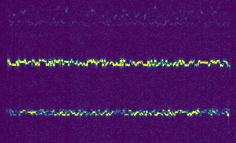

# WsprSharp

[](https://dev.azure.com/swharden/swharden/_build/latest?definitionId=17&branchName=main)

WsprSharp is a .NET Standard library for encoding/decoding messages using the [WSPR protocol](https://en.wikipedia.org/wiki/WSPR_(amateur_radio_software))

<div align="center">

</div>

## Quickstart

> **⚠️ WARNING:** This library is not ready for public use

```cs
// TODO: code example goes here
```

## Authors

WsprSharp began as a Visual Basic project for .NET Framework written by [Jeff J Weinmann](jwein.acs@gmail.com) (W8ZLW). [Scott W Harden](https://swharden.com/) (AJ4VD) uploaded it to GitHub (with permission) under an MIT license, added tests, and translated it to a C# library targeting .NET Standard.