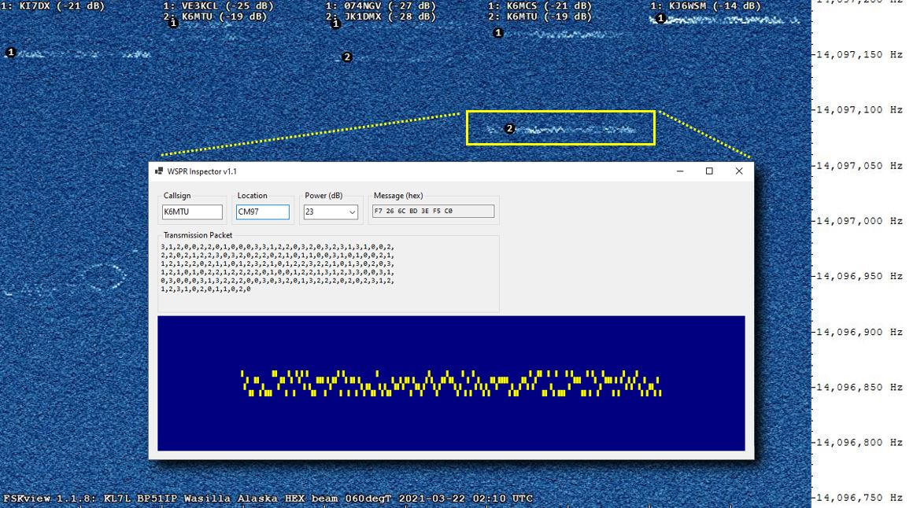
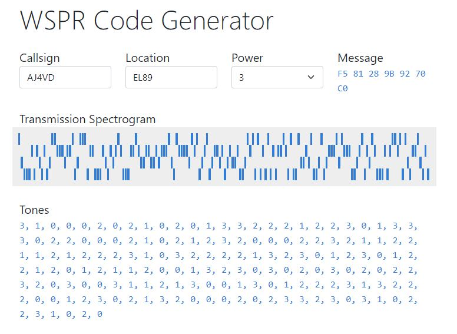
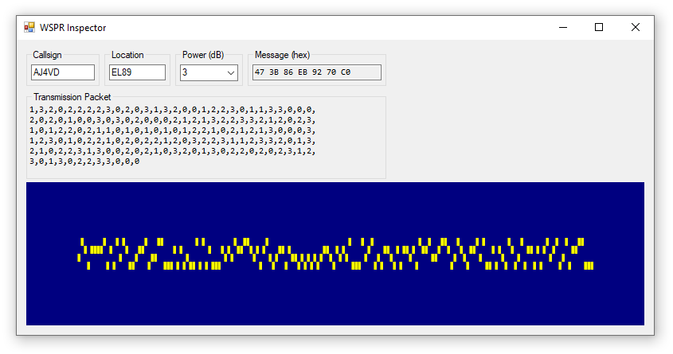

# WsprSharp

[](https://github.com/swharden/WsprSharp/actions/workflows/ci.yaml)

**WsprSharp is a .NET Standard library for encoding and decoding messages using the [WSPR](https://en.wikipedia.org/wiki/WSPR_(amateur_radio_software)) protocol.** This repository contains extra tools and documentation related to WSPR.

<div align="center">

</div>

This image shows a WSPR transmission captured in a [FSKview](https://swharden.com/software/FSKview) spectrogram. By typing the decoded information into the WSPR Inspector we can see what the full WSPR transmission looks like and inspect the contents of the message and transmitted packet.

## Quickstart

```cs
using WsprSharp;
var wspr = new WsprTransmission("AJ4VD", "EL89", 3);

Console.WriteLine("Message:");
Console.WriteLine(string.Join(" ", wspr.Message));

Console.WriteLine("Frequencies:");
Console.WriteLine(string.Join(" ", wspr.Levels));
```

```
Message:
71 59 134 235 146 112 192

Frequencies:
1 3 2 0 2 2 2 2 3 0 2 0 3 1 3 2 0 0 1 2 2 3 0 1 1 3 3 0 0 0 2 0 2
0 1 0 0 3 0 3 0 2 0 0 0 2 1 2 1 3 2 2 3 3 2 1 2 0 2 3 1 0 1 2 2 0
2 1 1 0 1 0 1 0 1 0 1 2 2 1 0 2 1 2 1 3 0 0 0 3 1 2 3 0 1 0 2 2 1
0 2 0 2 2 1 2 0 3 2 2 3 1 1 2 3 3 2 0 1 3 2 1 0 2 2 3 1 3 0 0 2 0
2 1 0 3 2 0 1 3 0 2 2 0 2 0 2 3 1 2 3 0 1 3 0 2 2 3 3 0 0 0
```

## WSPR Code Generator

[**WSPR Code Generator**](https://swharden.com/software/wspr-code-generator/) is a web application for generating WSPR transmission levels from user-provided callsign, location, and power information. This tool may be helpful for people interested in pre-programming a microcontroller with the frequency information needed to repeatedly transmit their station information using WSPR.

[](https://swharden.com/software/wspr-code-generator/)


## WSPR Inspector

**WSPR Inspector** is a small Windows application designed to visualize how changes to the WSPR inputs affect the message and frequency of the transmission. The latest version can be downloaded from the [Releases](https://github.com/swharden/WsprSharp/releases) page.




## Authors

WsprSharp began as a Visual Basic project for .NET Framework written by [Jeff J Weinmann](mailto:jwein.acs@gmail.com) (W8ZLW). [Scott W Harden](https://swharden.com/) (AJ4VD) uploaded it to GitHub (with permission) under an MIT license, added tests, and translated it to a C# library targeting .NET Standard.